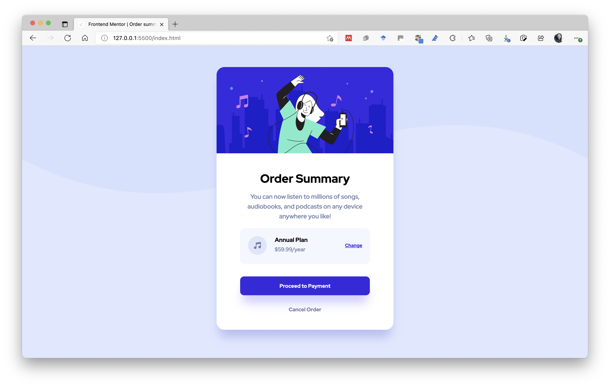

# Frontend Mentor - Order summary card solution

This is a solution to the [Order summary card challenge on Frontend Mentor](https://www.frontendmentor.io/challenges/order-summary-component-QlPmajDUj). Frontend Mentor challenges help you improve your coding skills by building realistic projects. 

## Table of contents

- [Overview](#overview)
  - [The challenge](#the-challenge)
  - [Screenshot](#screenshot)
  - [Links](#links)
- [My process](#my-process)
  - [Built with](#built-with)
  - [What I learned](#what-i-learned)
  - [Continued development](#continued-development)
  - [Useful resources](#useful-resources)
- [Author](#author)
- [Acknowledgments](#acknowledgments)

## Overview
This is a excercise provided by frontmentor, so i can improve my skills in coding.

### The challenge

Users should be able to:

- See hover states for interactive elements

### Screenshot

### Links

## My process
1-First i created the parent container and his child containers, which segment each part of the card, then i put its elments inside each child container, and add to each container and its elements their own classes using the BEM method, and then i applied flexbox and stylized each element according to the design provided by the designer.

### Built with

I built this project with HTML and CSS

### What I learned

I learned that i can move flex items with margin top in this case, i tried using only flexbox but i couldn't find the way to make it more precise.

### Continued development

I will implement the mobile version soon, im satisfied how it looked, its not very precise in regards of the box dimension as the real design.

### Useful resources

## Author

 Challenge by Frontend Mentor
 Coded by Jaime Rueda.

## Acknowledgments

